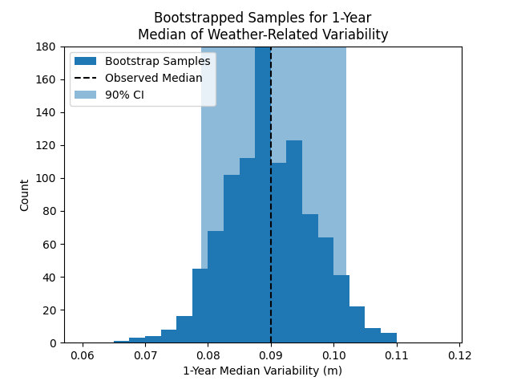
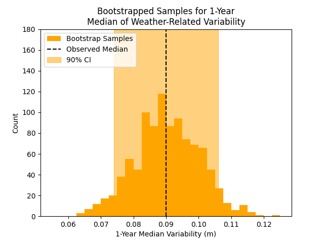

::: {.callout-note}
All of the code used in this homework is accessible in the hw06.ipynb file in my GitHub repository.
:::
```{=latex}
\newpage
```
# Problem 1: Salamanders & the Parametric Bootstrap
### 1.1

{#fig-1 width=5in}

The intercept from the Poisson Regression fit is -1.478, and the coefficient from the fit is 0.032. 
```{=latex}
\newpage
```
### 1.2
::: {#fig-2 layout-ncol=2 fig-pos="H"}
{#fig-2a width=4in}

{#fig-2b width=4in}

Histogram of Parametric Bootstrapped Poisson Fit a. coefficients and b. intercepts, with the coefficient from the fit in @fig-1 shown dashed in black. 90% Confidence inteval highlighted in the background.
:::

For the coefficient, the bias is -0.0008, and the 90% Basic Bootstrap CI is (0.039, 0.215). For the intercept, the bias is 0.0721, and the 90% Basic Bootstrap CI is (-0.522, -2.075).

### 1.3
Based on the above plots, there is relatively low uncertainty about the influence of ground cover on the expected number of salamanders. The 90% CI ranges are not very wide for either the intercept or the coefficient. More importantly, the CI is entirely above 0, which means that the influence of a 1% increase in ground cover on the number of salamanders is always positive. We can also verify that the data is likely a representative sample, since both statistics fall well within the bootstrap CI, and the bias is low for both.
```{=latex}
\newpage
```
# Problem 2: Norfolk Tide Gauge & the Structured Bootstrap
### 2.1
{#fig-4 width=5in}

The bias in the estimator is -0.00027, and the 90% CI is (0.078, 0.103). 
```{=latex}
\newpage
```
### 2.2
{#fig-5 width=5in}

The bias in the estimator is 0.00083, and the 90% CI is (0.073 0.106). The bias is still very low/near-zero, although it did increase slightly. The confidence interval widened, with the low-end decreasing by 0.003 and the high-end increasing by 0.005. 

### 2.3
Since the block sizes are larger, there are fewer blocks in each bootstrapped time series, which makes the bootstrap sample medians more susceptible to drawing a block with an outlier median. These extreme blocks would have a larger effect on the bootstrap sample medians in a length-50 bootstrap case than a length-20 case, thus explaining why the CI expanded.
```{=latex}
\newpage
```
# Problem 3: Chicago Deaths & Missing Data
### 3.1
The `death`, `o3median`, `time`, and `tmpd` columns have no missing data. For the others, there are:

* 251 missing entries in `pm10median`
* 4387 missing entries in `pm25median`
* 27 missing entires in `so2median`

### 3.2
::: {#fig-6 layout-ncol=2 fig-pos="H"}
{#fig-6a width=4in}

{#fig-6b width=4in}

Exploratory Data Analysis of missing values in the chicago deaths dataset.
:::

In @fig-6a, the missing values for `pm10median` appear to cover the distribution of `death` (with the exception of the very high outliers), which suggests that the missingness is not dependent on the y variable (`death` in this case, since we have been focusing on predicting `death` with the environmental data). However, in @fig-6b, the missing values seem to come disproportionately from times earlier in the dataset. Since time is left unmodeled when attempting to predict `death` from `pm10median`, yet influences both, proceeding with complete-case analysis will likely lead to skewed results due to this time dependence of missing values. Thus, the `pm10median` data is Missing Not At Random.  